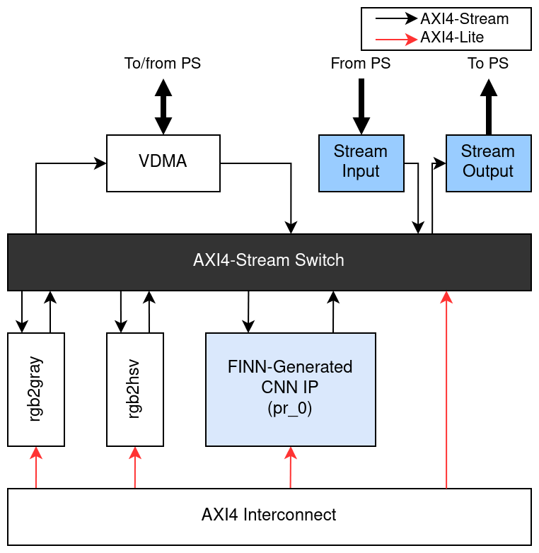

# Lightweight CNN Image Classifier with On-chip Preprocessing

Integrate the VGG-like CNN network generated by [FINN](https://github.com/Xilinx/finn) with the color conversion preprocessing functions in [PYNQ Composable Pipeline](https://github.com/Xilinx/PYNQ_Composable_Pipeline). 

## Introduction

### Dataset

[CIFAR-10](https://www.cs.toronto.edu/~kriz/cifar.html), converted to grayscale with OpenCV

### CNN Network

This `VGG-5` network is similar to [VGG-11](https://pytorch.org/hub/pytorch_vision_vgg/) but with fewer layers and channels.

|           | Kernel Shape | Padding | Stride | Quantization | Output Shape | Output Channels |
|-----------|:------------:|:-------:|:------:|:------------:|:------------:|:---------------:|
|  conv3-64 |      3x3     |    1    |    1   |     INT4     |     32x32    |        64       |
| maxpool-2 |              |         |        |              |     16x16    |        64       |
|  conv3-96 |      3x3     |    1    |    1   |     INT3     |     16x16    |        96       |
| maxpool-2 |              |         |        |              |      8x8     |        96       |
| conv3-128 |      3x3     |    0    |    1   |     INT3     |      6x6     |       128       |
| maxpool-2 |              |         |        |              |      3x3     |       128       |
| conv3-192 |      3x3     |    0    |    1   |     INT4     |      1x1     |       192       |
|   FC-10   |      1x1     |    0    |    1   |     INT3     |      1x1     |        10       |

### Composable Pipeline

This project simplifies **PYNQ Composable Pipeline v0.9.0** and removes HDMI I/O ports.

<p align="center"></p>

## Rebuild the Project

### Requirements

* Ubuntu 18.04, or other GNU/Linux distributions
* Docker without root
* Vivado 2020.1 and Vivado 2020.2
* [PyTorch >= 1.5.0](https://pytorch.org/)
* [Brevitas >= v0.7.0](https://github.com/Xilinx/brevitas)
* [FINN v0.7](https://github.com/Xilinx/finn/releases/tag/v0.7)
* [TUL PYNQ-Z2 development board](https://www.tulembedded.com/FPGA/ProductsPYNQ-Z2.html)

### Procedure

1. Install Brevitas and replace `brevitas_examples/bnn_pynq/` with `./bnn_pynq/` .

   Follow the instruction in [`./bnn_pynq/README.md`](./bnn_pynq/README.md) to train the `VGG-5` model, \
   and then move the trained `./bnn_pynq/VGG.onnx` to `./FINN/model.onnx` .

2. After setting up environment variables for FINN, execute

   ```sh
   ./run-docker.sh build_custom Xilinx-HLS/Preprocess_CNN_Pipeline/FINN
   ```

   under the root directory of FINN to build the CNN IP in advanced build mode.

3. The deployment package will be generated under \
   `./FINN/output_vgg_gray_Pynq-Z2/deploy/` .

   If batched top-1 accuracy validation is needed, put \
   `./FINN/driver/validate.py`, `./FINN/driver/testx_gray.npy`, `./FINN/driver/testy.npy` \
   into the deployment package.

4. The out-of-context stitched IP will be generated under \
   `./FINN/output_vgg_gray_Pynq-Z2/stitched_ip/ip/` .

   It can be further used in building customized Composable Pipeline.