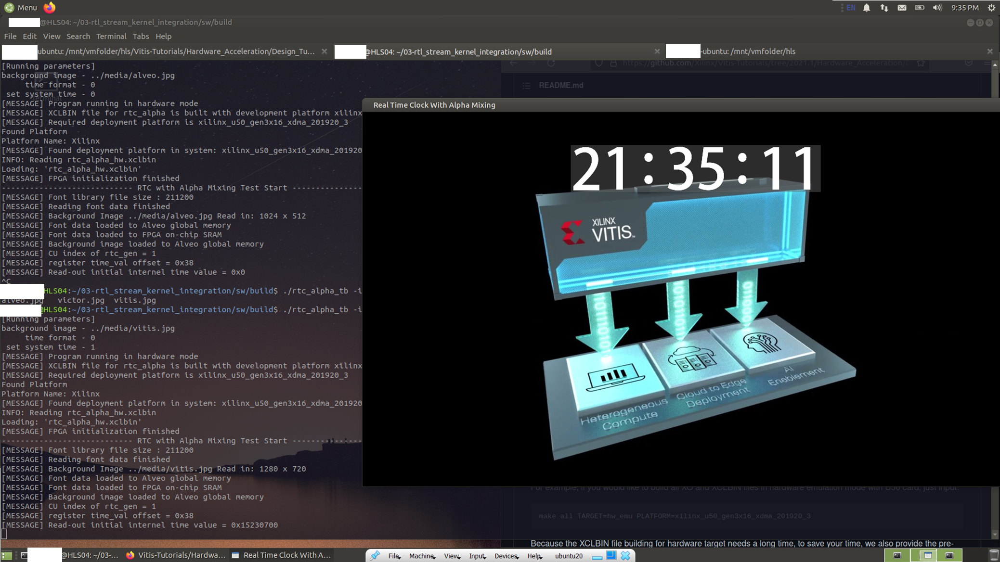

# hls_lab_b

* This repository is the result of the official tutorial [03-rtl_stream_kernel_integration](https://github.com/Xilinx/Vitis-Tutorials/tree/2021.1/Hardware_Acceleration/Design_Tutorials/03-rtl_stream_kernel_integration)

* The xclbin exceeds 25MB of github. Therefore, only host program compiled on course server is uploaded
  * pre-compiled xclbin can be obtained from [here](https://www.xilinx.com/bin/public/openDownload?filename=rtl_stream_kernel_xclbin_2020.2.tgz)

To run the program, put (1) xclbin file in the same folder (2) prepare an image. 

```
source /opt/xilinx/xrt/setup.sh                       # set Xilinx runtime environment 
source /opt/xilinx/Vitis/2020.2/settings64.sh         # set Xilinx toolchain path
source setup_emu.sh -s off                            # run in hardware mode 
./rtc_alpha_tb -i vitis.jpg -s                        # toggle option -s to select counter or clock 
```

The execution on HLS04 course server (user information is hidden in this image): 


